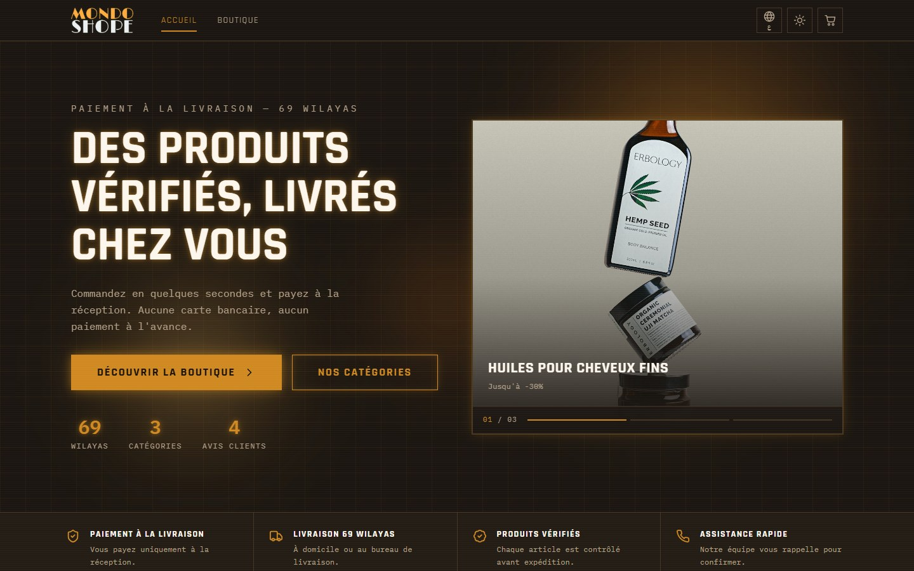
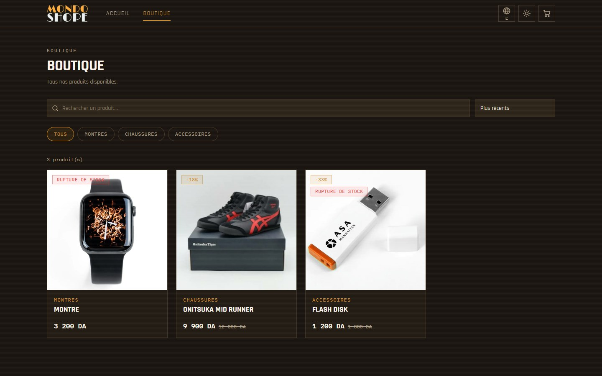
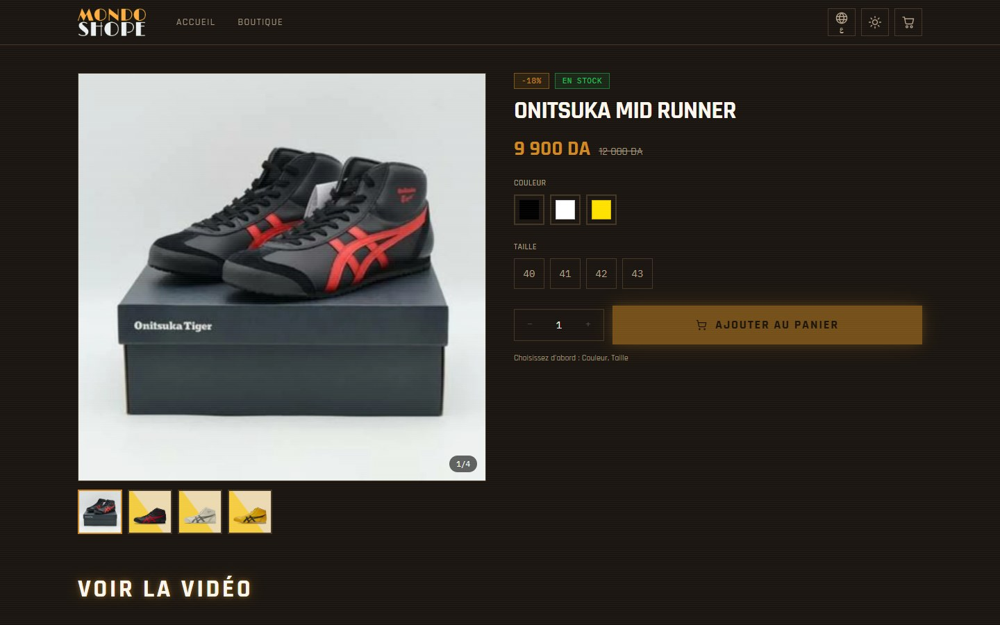
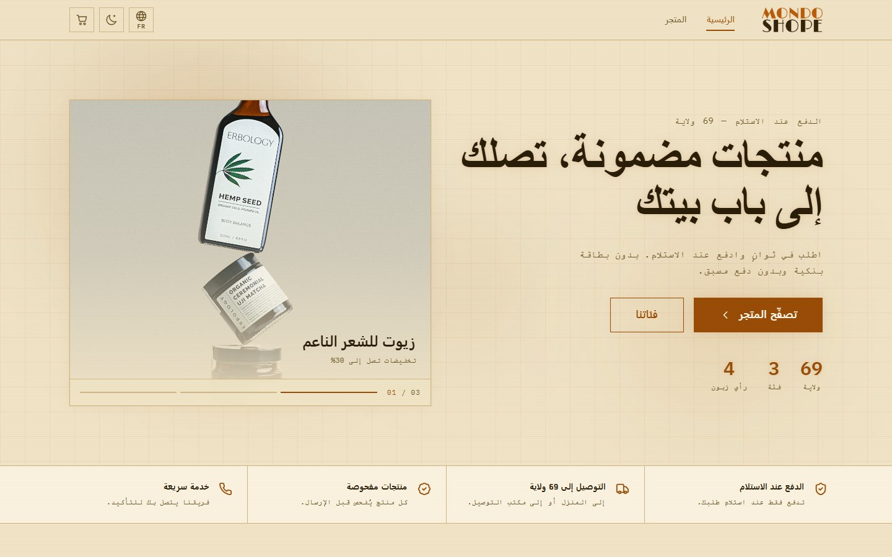
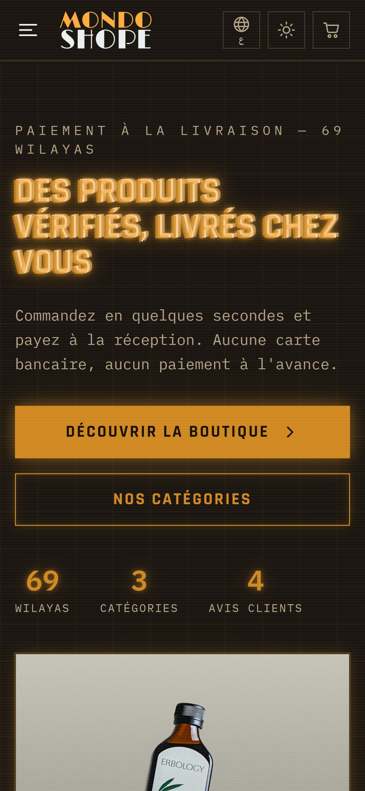
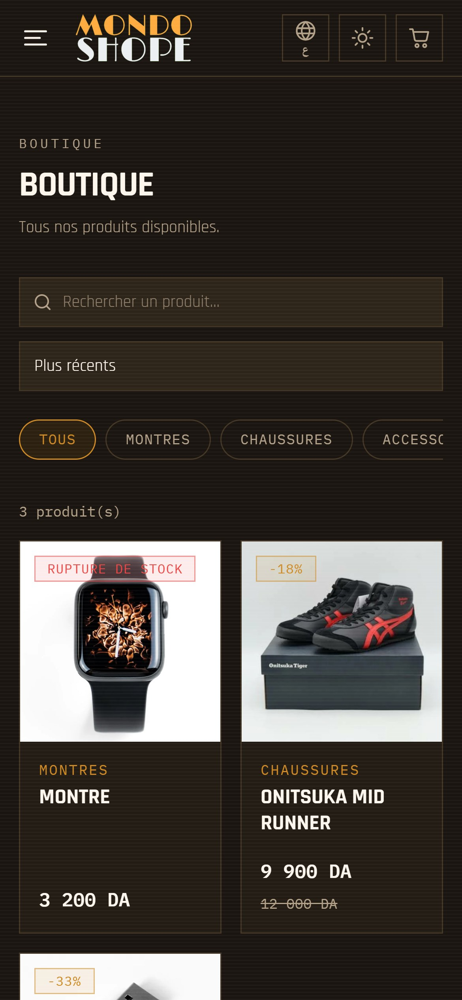
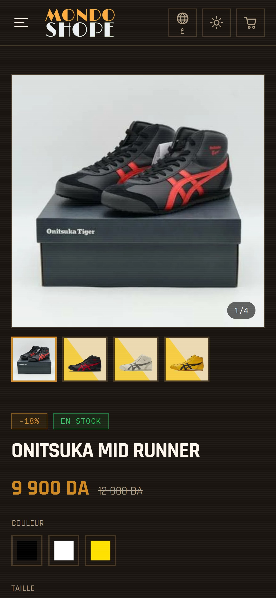
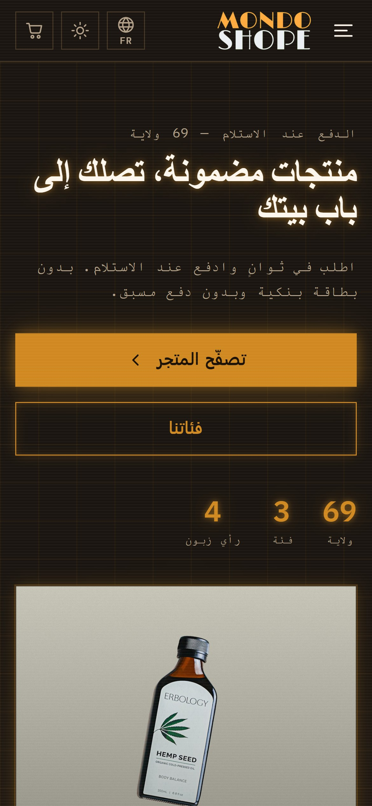

<div align="center">


# Mondo Shope

**A bilingual cash-on-delivery e-commerce platform for the Algerian market, with a full admin dashboard and landing-page builder.**

[Live site](https://www.mondoshope.shop) · Designed & built by **Alaa Younsi**


</div>

---

## Overview

Mondo Shope is an online store built for the way people in Algeria actually shop: they
**pay cash when the parcel arrives**, choose between **home or delivery-office drop-off**, and
browse in **French or Arabic**. A customer can place an order in seconds with just their name,
phone number, wilaya and commune. There's no account, no card, and no payment up front.

The store owner runs everything from a private dashboard: the catalogue and stock, orders,
delivery prices for all 69 wilayas, customer reviews, homepage content, Meta advertising pixels,
and one-off **campaign landing pages** built from drag-and-order blocks, with no developer
needed.

## Design concept

The visual identity is a **retro-futuristic "neon terminal"**: a near-black canvas, a warm
amber accent, monospaced type, a faint scanline texture, glowing edges and hard-cornered panels.
It's meant to feel premium and technical, and it stands apart from the generic white-template
stores common in the market.

- **Dark by default, light on demand.** A parchment-toned light theme is fully tokenised, not an
  afterthought. Every colour is a CSS variable swapped by one attribute.
- **Truly bilingual.** Arabic isn't just translated, it's **mirrored**: the full layout, drawers,
  sliders and swipe gestures flip for right-to-left reading, with a dedicated Arabic typeface.
- **Mobile-first.** Most traffic comes from phones via social ads, so every tap target clears
  44 px and every screen was designed at 390 px first.
- **Motion with restraint.** Entrance animations, a cross-fading hero slider and ambient glows
  all switch off under `prefers-reduced-motion`, on slow connections and in data-saver mode.

## Screenshots

### Desktop

| Home | Shop |
| :---: | :---: |
|  |  |
| **Product** | **Arabic (RTL) · light theme** |
|  |  |

### Mobile

| Home | Shop | Product | Arabic (RTL) |
| :---: | :---: | :---: | :---: |
|  |  |  |  |

## Features

### Storefront
- Product catalogue with categories, search and sorting
- Product variants: **colours** (each with its own photo), **sizes**, and **custom options**, each
  with its own stock, plus an optional **colour × size stock grid** so exact combinations never
  oversell
- Quantity offers ("buy 2, get 1 free", "3 for X DA"), priced live in the cart
- Cart checkout **and** one-step "buy now" directly on the product page
- Delivery priced per wilaya (home or office), with an optional free-shipping threshold
- Order confirmation page with a full recap
- French / Arabic with full RTL, dark / light theme, both remembered between visits

### Admin dashboard
- Sales overview: orders, pending count, booked revenue and low-stock alerts
- Product editor with image upload (auto-compressed to WebP in the browser), video, variants,
  stock grid and offers
- Order management with status workflow, automatic restocking on cancellation, and **Excel
  export** for the delivery company
- Delivery prices and availability for all 69 wilayas
- Categories, customer reviews, announcement bar, hero slider and marquee copy
- **Meta Pixel manager**: multiple pixels, each scoped to all pages, specific paths, products or
  landing pages, with per-event toggles
- **Landing-page builder**: 14 block types (hero, offer, order form, countdown, gallery, video,
  FAQ, reviews…), per-page theme, SEO fields and pixels, draft preview, publishing at
  `/lp/<slug>` with no redeploy
- Secure sign-in, password change and e-mail password recovery

## Tech stack

| Layer | Technology |
| --- | --- |
| Frontend | React 18, TypeScript (strict), Vite 6 |
| Styling | Tailwind CSS with CSS-variable design tokens, Framer Motion |
| State & data | TanStack Query, Zustand (persisted cart) |
| Forms & validation | React Hook Form + Zod |
| Backend | Supabase: PostgreSQL, Row-Level Security, Auth, Storage, PL/pgSQL RPCs |
| Hosting | Vercel, with an Edge Middleware for social link previews |
| Tooling | Bun, ESLint, Excel export via SheetJS (loaded on demand) |

## Security

- **Server-side pricing.** The browser never sends a price. A single PostgreSQL function
  (`place_order`) re-reads every product, applies offers, prices delivery and computes the
  total inside one transaction, with the product rows locked against race conditions.
- **Row-Level Security on every table.** Writes require an explicit admin allow-list checked in
  the database, not just "any logged-in user", so the public API key grants nothing beyond
  what the storefront shows.
- **Customer data stays private.** Orders have no public read access at all. The confirmation
  page goes through a narrow function that never returns phone numbers or addresses.
- **Abuse protection.** Server-side validation of every field, rate limits per phone number,
  stock checks that reject rather than clamp, a hard **3-pieces-per-item** limit enforced in the
  database, and a honeypot plus timing check against form bots.
- **Hardened output.** Excel exports neutralise formula injection, video embeds are rebuilt
  from validated IDs, and HTTP security headers (HSTS, CSP directives, `nosniff`,
  frame protection, a restrictive permissions policy) are set at the edge.
- **Account safety.** Changing the password requires the current one, and recovery links are
  consumed and stripped from the URL immediately.

## Performance

- **Code-split by route.** The admin dashboard, landing pages, checkout and Excel export are
  separate bundles that shoppers never download unless they need them. The storefront entry is
  about **54 kB gzipped**.
- **Images:** compressed to WebP (≤ 1400 px) before upload, cached for a year, lazy-loaded with
  explicit dimensions (no layout shift), and the hero/product image is fetched with high
  priority as the LCP element.
- **Network:** early `preconnect` to the API and font origins, one-year immutable caching for
  hashed assets, and data caching that avoids needless refetches on mobile connections.
- **Adaptive effects:** heavy decorative layers are skipped on phones, slow networks, data-saver
  mode and reduced-motion preferences.

## SEO

- Per-page titles, descriptions, canonical URLs, Open Graph and Twitter cards
- Structured data: `WebSite` with site search, `Store`, and `Product` with price, availability
  and brand
- Sitemap generated from the live catalogue at every build, plus `robots.txt` excluding
  checkout, confirmation and admin pages
- Transactional pages marked `noindex`; bilingual `fr-DZ` / `ar-DZ` locale metadata
- Edge middleware that serves rich link previews (product name, photo and price) to Facebook,
  WhatsApp, Instagram and Telegram, while search engines index the real rendered page

## Project structure

```
src/
├── components/     UI kit, layout, product, checkout, landing blocks, admin editors
├── pages/          Storefront routes and the lazy-loaded admin dashboard
├── hooks/          Data fetching (TanStack Query), SEO, auth, uploads
├── lib/            Pricing mirror, stock logic, pixels, formatting, utilities
├── i18n/           French / Arabic translations and RTL provider
├── store/          Persisted cart (Zustand)
└── types/          Database and landing-page types
supabase/migrations/  Schema, RLS policies and business-logic functions (0001–0014)
middleware.ts         Vercel Edge link-preview middleware
```

## Running locally

Requires [Bun](https://bun.sh) and a Supabase project.

```bash
bun install
cp .env.example .env    # add your Supabase URL and anon key
bun run dev
```

Database setup, deployment and the go-live checklist are documented in
[`docs/DEVELOPMENT.md`](docs/DEVELOPMENT.md).

## Author

**Alaa Younsi** designed and built Mondo Shope end to end: the product design, frontend, backend,
database and deployment.

## License

**© 2026 Alaa Younsi. All rights reserved.**

This is proprietary software. You may not copy, modify, distribute or reuse any part of it
(code, design or assets) without prior written permission. See [LICENSE](LICENSE).
